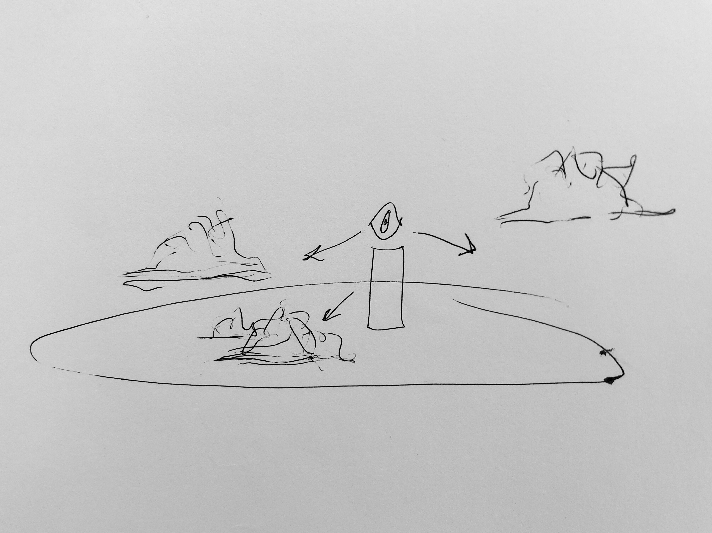
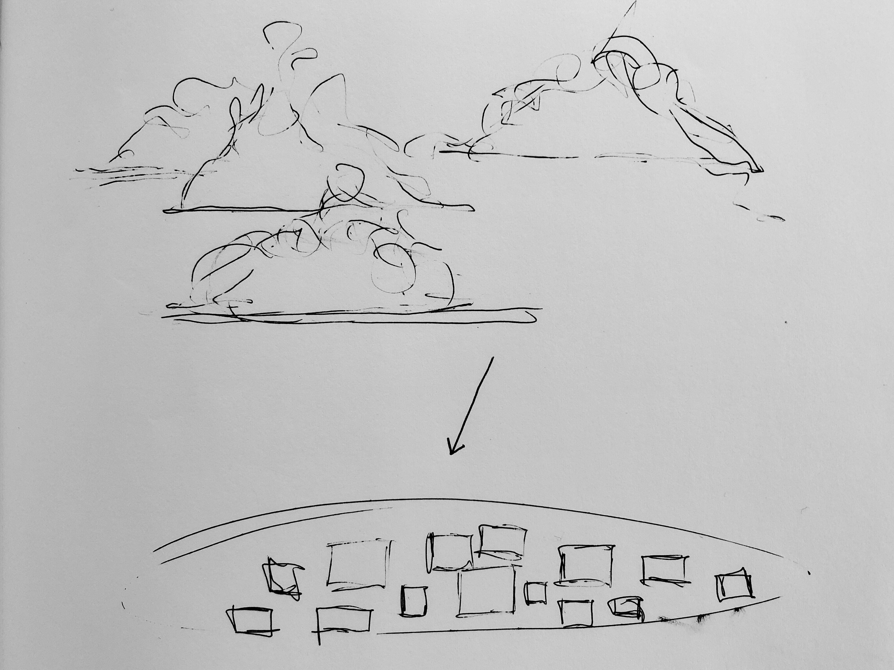
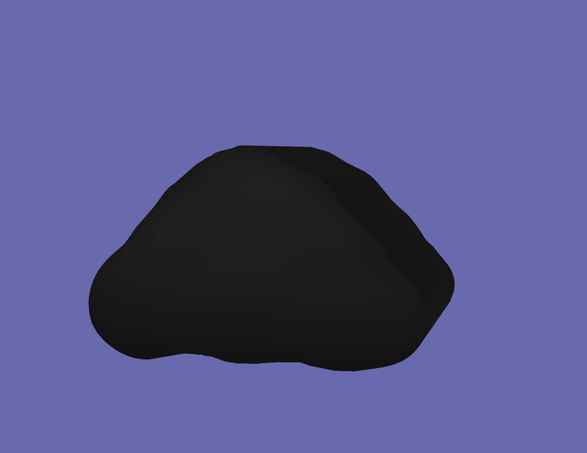

# Seminar Essay

## Shadow-Quest: Imperatives for Knowledge Production in Dark Times

Our entanglement with shadows stretches long and cuts deep across thick time, here narrow, there wide, in some cases quiet and familiar, inimical and strange in others. “Shadow” does not refer to a property of a thing 1, rather it depends on its positioning and demands that questions be asked. The relationship between shadow and light cannot be dissolved, as one defines the other, yet we can observe the pliability of their boundary as it moves in different directions, never to disappear. Information contained within the shadow itself is indeed hidden, but only partially, and thus can be represented and imagined in scholarly research and creative practices. 

## Media

{::nomarkdown}
<video width="100%" height="auto" controls>
  <source src="assets/Dynamic Shadow Graph v2.mov" type="video/mp4">
</video>
{:/}

## Works Cited				
Anzaldua, Gloria. “Let Us Be the Healing of the Wound: The Coyolxauhqui Imperative—La Sombra y el Sueño.” *This bridge we call home,* edited by Gloria Anzaldua and Ana Louise Keating. Routledge, 2009, pp. 9-22.			

Barfield, Owen. *What Coleridge Thought.* Wesleyan UR, 1971.			

Barthes, Roland. *The Pleasure of the Text.* Hill and Wang, 1975.

Bartlett, C., Marshall, M., & Marshall, A. "Two‐Eyed Seeing and Other Lessons Learned Within A Co‐Learning Journey of Bringing Together Indigenous and Mainstream Knowledges and Ways of Knowing. *Journal of Environmental Studies and Sciences,* vol. 2, no. 4, 2012, pp. 331–340, doi.org/10.1007/s13412‐012‐0086‐8.			

Batchen, Geoffrey. *Burning with Desire: The Conception of Photography.* MIT Press, 1999.				

Berger, John and Jean Mohr. *Another Way of Telling.* Vintage Books, 1982. 					

Coleridge, Samuel Taylor. "The Friend." *The Collected Works of Samuel Taylor Coleridge,* edited by Kathleen Coburn, Princeton UP, 1969.		

------ . "Theory of Life." *The Collected Works of Samuel Taylor Coleridge,* edited by Kathleen Coburn, Princeton UP, 1995, pp. 481-557. 

------. "Biographia Literaria." *SamuelTaylor Coleridge: The Major Works,* edited by H. J. Jackson, Oxford UP, 2000. pp. 155-482. 

Costello, Mark. “Biodiversity: The Known, Unknown, and Rates of Extinction.” *Current Biology,* vol. 25, no. 9, 2015, pp. R368-71. 	

Conover, Emily. “‘Shadow Biosphere’ Might Be Hiding Strange Life Right Under Our Noses.” *Science (American Association for the Advancement of Science),* doi:10.1126/science.aaa7865.

Hackett, Edward. “Essential Tensions. Identity, Control and Risk in Research.” *Social Studies of Science,* vol. 35, no. 5, 2005, pp. 787-826.	

Jung, Carl. *The Archetypes and the Collective Unconscious.* Princeton University Press, 1981.		

Merton, Robert. “Three Fragments from a Sociologist’s Notebooks: Establishing the Phenomenon, Specified Ignorance, and Strategic Research Materials.” *Annual Review of Sociology,* vol. 12, no. 1, 1987, pp. 1-28. doi.org/10.1146/annurev.so.13.080187.000245.			

Newhall, Beaumont. *The Daguerreotype in America.* Dover Publications, 1976. 

Proctor, Robert. “Agnotology: A Missing Term to Describe the Cultural Production of Ignorance.” *Agnotology: The Making and Unmaking of Ignorance,* edited by R. Proctor and L. Schiebinger, Stanford University Press, 2008, pp. 1-36. 

Snow, C. R. *The Two Cultures and the Scientific Revolution.* Cambridge University Press, 1993.

Talbot, William Henry Fox. "A Brief Historical Sketch of the Invention of the Art." *Classic Essays on Photography,* edited by Alan Trachtenberg, Leete's Island Books, 1980, pp. 27-36. 	

------. "Some Account of the Art of Photogenic Drawing, or the Process by Which Natural Objects May Be Made to Delineate Themselves Without the Aid of the Artist's Pencil." Newhall, Photography, 23-31. 	

## Abstract and Prototype(s)

**CLOUDS :+:+:+: SHADOWS :+:+:+: REFLECTIONS**

This project will emerge as a website or twine game and comprise text, video, sound, and potentially some pencil drawings or illustrations. I aim to construct visualizations that will be beautiful as well as meaningful, in the manner of Stephanie Posavec’s infographics.

There are **two** still yet unformed and milky trajectories in play — one leaning nonrealist, the other realist:

1) *Among the Clouds* is a very short text written by Mary Ruefle (see below), which I read in the Spring. For me, this text intersected with the inception of the pandemic — the first wave. Ruefle’s story is about clouds but because clouds are amorphous, ephemeral, and indistinct entities they could easily be transposed with other phenomena — we might then experiment by replacing clouds with Covid-19. Playful, creative thinking challenges previously-held characterizations of the human as bound and autonomous and uncovers new narratives. Like Ruefle’s clouds, the virus appeared suddenly ubiquitous and seemingly “irrational, impossible, baffling and alarming,” casting  “long shadows in an unearthly light” across our lives. Ruefle’s text would function as a guide, or a framework for mapping the first wave of the virus. Information for the mapping would derive from a yet-to-be-decided source (journal article, social media, news outlet?). Visualizations of virus-as-clouds would be made by me (still and moving images with elements of college?). This reflection of the virus, expressed through the imagery of clouds, will take a nonrealist approach, allowing us to reimagine the virus both from a distance (temporally - looking back/reflecting) and up close through the visualization. 

Idea #1

2) *Today, you are a cloud. You are floating roughly 6500 feet above the surface of Earth. You observe the activity below and this is what you see.*

The alternative is to make the viewer the cloud, which would encourage an objective, removed (but curious?) perspective. Both idea #1 and #2 contain the potential to address spatial/temporal gaps through storytelling, presenting a kind of double image (reflection) that demonstrates clarity from a distance (realist), jumble up close (nonrealist) (Geertz in McCarty 115). The reflection occurs on two levels: a) returning to and reexamining an event in recent history; b) through the use of coloured plexi (video below) which creates a similar effect to the double exposure. The cloud-viewer might travel from the troposphere to the Earth’s surface — telescoping or compressing the space between past and present, distance and intimacy, local and universal. This experience would begin with the italiczed text above and incorporate found footage (manipulated by me?), perhaps located through hashtags that are themselves derived from a larger “text” (social media, news outlets, etc).

Idea #2

<iframe src="https://player.vimeo.com/video/483121354?title=0&byline=0&portrait=0" style="position:absolute;top:0;left:0;width:100%;height:100%;" frameborder="0" allow="autoplay; fullscreen" allowfullscreen></iframe>

Experimenting with coloured plexi as a form of reflection in the sense of looking back and creating a double image.

**Among the Clouds by Mary Ruefle**

That was the summer there were so many clouds we didn’t know what to do with them. They overflowed the sky—they were on our streets, in our homes, in our drawers and in our cabinets. They were in our cars and on our buses, I even saw them in taxis. No one had ever seen so many clouds, to the extent, as often happens with a glut, no one could remember a time without them. Our legislators tried to ship them to another country but the question came back—what would one do with so many clouds? There was no wind, no rain, nothing to break them up or break off the endless building up of them. Ship them to Mars, someone said, but Mars could not sustain them. You needed an atmosphere for that, and how odd was that, since so many clouds clouded our atmosphere and every citizen felt they were in a play, at the theatre, overcome by another’s mood, at the mercy of the infinite nostalgia of subconscious dictates. I was not the first to be surprised and often terrified by their images. They cast long shadows in an unearthly light. Some were blue, some were gray, some black, some white, some were pink, some were lavender, some orange, some a ghastly purple. All cast a trance and a silence upon us. I registered without choice the complaints of a multitude. Our dreams of a solution, even the most obscure, dissolved in the profound and vital roots of an intractable reality. The picture of a limp cloud watching us was undeniable. They were irrational, impossible, baffling and alarming, solitary, in strata, stippled as a fish back, fantastically shaped and plain as the day is long. They hypnotized us and paralyzed us. Yet they remained, in the highest and lowest places, and the meticulous exact realism of them convinced us to capture them, and zoo them, and feed them, to the extent others, far into the researchable future, would be able to see what was the temporary but encroaching weight of their total reality, and perhaps understand our hopelessness of ever understanding them, why they were so crowded among us, given we were crowned with brains to override them, which proved impossible, though there are so few left who remember. Even now, so many years later, when strolling idly, say on a Sunday, under a spotless sky, when I meet a child carrying in her right hand, like a torch, a tuft of spun sugar on a stick, the familiar cry of that summer comes back to me, the one that floated out of the mouths of so many children: o mother, o father, wherefore art thou? I cannot see to find thee among so many clouds. 

**Works Cited**

McCarty, Willard. *Humanities Computing*. Palgrave Macmillan, 2005.

Ruefle, Mary. *My Private Property*. Wave Books, 2016.

**CLOUD: TAKE 1**

