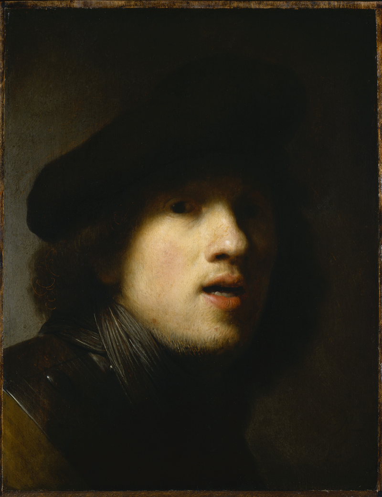
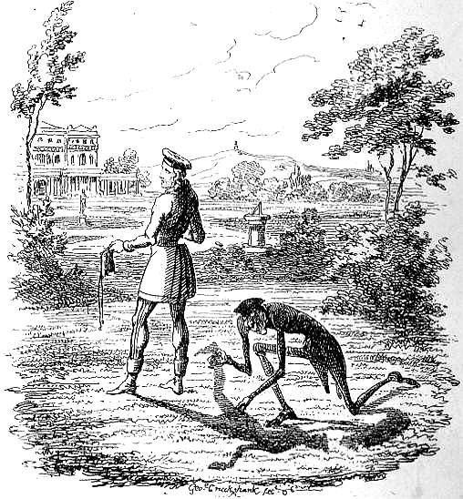
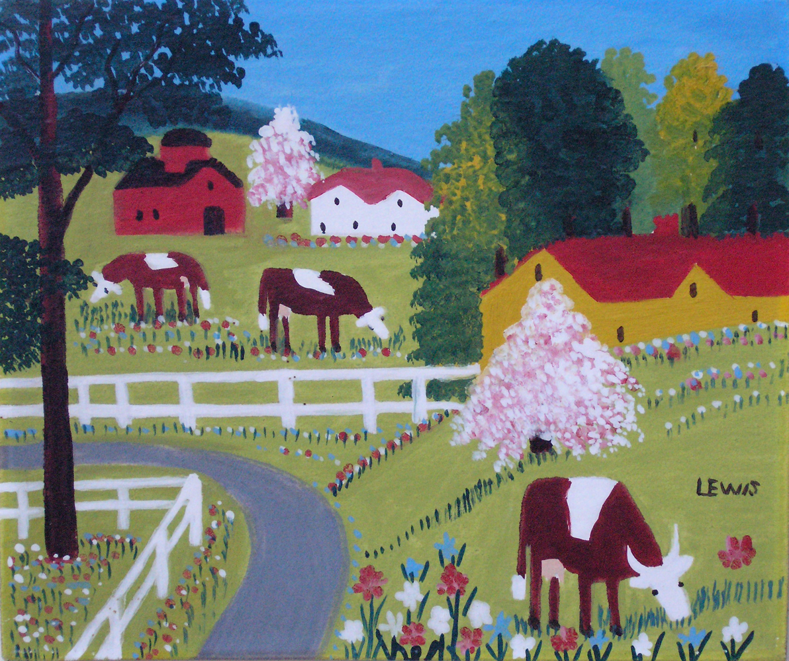
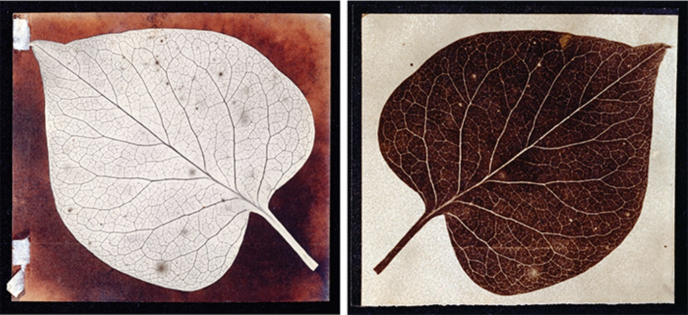

# Seminar Essay

## Shadow-Quest: Imperatives for Knowledge Production in Dark Times

Our entanglement with shadows stretches long and cuts deep across thick time, here narrow, there wide, in some cases quiet and familiar, inimical and strange in others. “Shadow” does not refer to a property of a thing1, rather it depends on positioning and demands that questions be asked. The relationship between shadow and light cannot be dissolved, as one defines the other, yet we can observe the pliability of their boundary as it moves in different directions, never to disappear. Information contained within the shadow itself is indeed hidden, but only partially, and thus can be represented and imagined in scholarly research and creative practices. 1

In proposing “shadow” as a metaphor to explore non-knowledge, I aim to make explicit the role of the unknown (data that is beyond reach, secret, concealed) in how we come to understand and know the world. I consider the ways in which light and vision function in realist epistemologies and propose that non-realist approaches implement “shadow material” in the creation of knowledge. Realist approaches embrace a totalizing, top-down, and objective view of reality, privileging linearity over non-linearity. Conversely, non-realist approaches favour spatial and temporal distortion, ambiguity, a plurality in ways of knowing, and operates from a subjective frame of reference. Where the realist gaze surveys the world from on high, the nonrealist gaze is embedded and embodied on the ground level. Only by recognizing and embracing both approaches — the light and shadow dimensions of knowledge — can we begin to respond to the complexity of the world and our place within it.

In this essay, I will first briefly trace our cultural relationship with shadows across time. I will then investigate the play of shadow and light knowledges through technologies of seeing: the microscope and photography. By exploring notions of polarity in conjunction with photography, I will show how this medium strikes a balance between shadow and light, art and science, nonrealist and realist ways of thinking and making sense. Crafting knowledge in our troubled and challenging times is most effective when the integration of both realist (objective, quantifiable, visible) and non-realist (subjective, qualitative, hidden) techniques are applied. I visualize this entanglement of knowledge and ignorance through a dynamic graph prototype. This graph is based on Ursula K. Le Guin’s novel *The Wizard of Earthsea* and aims to demonstrate how the shadow is inseparable from light, how the material and immaterial are deeply entwined, and thus how realist and non-realist approaches to the production of knowledge best reflect the problematics of our time. I end with a call for researchers to attend to data shadows in their own analyses. In the spirit of recognizing difficulties of doing, I suggest that we need ways of acknowledging and articulating the salience of absence and the shadowy nature of the evidence we utilize in our work. 	

Some 2,400 years ago, Plato addressed questions of knowledge and perception in his pivotal Allegory of the Cave — perhaps history’s most masterful figurative inquiry into the meaning of life and the nature of reality — found in Book VII of his *Republic*. In this famous parable, Plato imagines a group of prisoners that have been confined in a cavern, essentially bred in captivity, with no knowledge of the outside world. The prisoners are chained in place and, unable to turn their heads, their field of vision eclipsed by the cave wall upon which shadows flicker and flit. The prisoners, who believe these shadows to be real — actual entities — name and classify the shapes, mistaking appearance for reality. In this story, Plato linked the image with the shadow — both were copies of reality — imbuing them with a negative charge. For Plato, attaining true knowledge required one to renounce the shadows by progressing out of the cave and into the light.

Roughly 300 years after Plato published his story on the origins of knowledge, Pliny produced *The Natural History*, explicating the origin of painting. One of the most important differences between these two works is that, in Pliny’s story about the origin of representation, the shadow is not disparaged: the story of the maid of Corinth tracing her lover’s shadow on a wall and thereby giving birth to painting is romantic — a love story. Where Pliny celebrated representation as arising through a deep and generative intimacy with the dark, Plato insisted that shadows were misleading about the true nature of reality. Compellingly, despite (or because of) Pliny’s glowing embrace of the shadow, his myth was slowly forgotten. Plato’s allegory, in contrast, has captured imaginations and engendered myriad interpretations for two and a half millennia. My argument draws on the interplay between Plato’s two worlds — one predicated on shadow and ignorance, the other on light and knowledge.

Joseph Benoit Suvee, *The Invention of the Art of Drawing*, 1791

For Plato, knowledge and reason are vehicles to truth. The long intellectual tradition of rationalism, extending from Plato to Descartes — powering through the Age of Enlightenment and beyond — sutures light, vision, and the ability to see into resolute union with truth and knowledge. Rene Descartes’ concept of dualism — the separation of mind and body — would place increasing reliance on the cognitive capacities of the human in the seventeenth century. The Enlightenment worldview, which renders our planet transparent and demystified, embodies a realist approach to knowledge production. Realist epistemologies drown the symphonic complexity of the emotional universe, relegating the unconscious, intuitive, sensual experiences associated with the body to the shadowy status of the subjective. Thus, the importance of subjective experiences, as components in how we come to understand and know the world and ourselves, is suppressed. Realist modes of thinking, which appear in empiricist and positivist epistemologies, emphasize rational, discursive argument and analysis, and have come to dominate the natural sciences, which in turn have come to rely extensively on our ability to observe: to see. Linking the human eye with the acquisition of knowledge is a practice as old, if not older, than the philosophy of Plato. 

Non-realist approaches embrace the shadows of all that is foregrounded in realist epistemologies — tending to subjectivity, fragmentation, contradiction, ambiguity, and marginalia. Shadows contain a theatre of polarity within themselves. On one hand, they offer a sense of realism. Ubiquitous features of our visual environment, shadows are an invaluable resource as their visibility can signal various properties of things, including presence, location, shape, and size. On the other hand, shadows represent the dark side of phenomena — the gap in human knowledge that we call ignorance.  Often the term “shadow” is used pejoratively, suggesting that something is diminished, however, my paper seeks to reveal the value of shadows in the production of knowledge. Examining data that are not there, not readily available, or not usable toward proving claims or fostering discoveries brings us to confront the significance of what is not typically recognized as knowledge—what is invisible, ignored, forbidden, expected, or inaccessible. The deployment of “shadow” as a metaphor to look into the specificities of non-knowledge allows a deeper insight into the continuities and discontinuities inherent in the production of knowledge.

Because of the realism they offer and because of their visual and conceptual complexity, shadows have long fascinated artists. Beyond providing information about the phenomena to which they belong, shadows reveal a rich historical commentary concerning the arenas of the social and psychological. We register shadows both consciously and unconsciously, reading them in a cultural context that lends shadows power or denies their substance, so that they may appear prophetic or threatening, obstructive or yielding. 

To represent a cast shadow with accuracy requires robust knowledge of perspective. This was one of the most important features of Renaissance painting, beginning with Alberti and Leonardo. The Renaissance secured the shadow’s role not only as an approach to pictorial realism but as emblematic of the psychological weight we bear. In 1628, Dutch master Rembrandt embraced shadows with his deft application of chiaroscuro — from the Italian *chiaro* (“clear, bright”) and *oscuro* (“dark, obscure”) — literally bright-dark. The term describes the effects of light and shade in a work of art, particularly when they are strongly contrasting. In an early self-portrait, Rembrandt depicts himself with eyes buried in swollen shadows, signalling a connection between vision and the light and dark forces of the psyche. 

Rembrandt, *Self-portrait*, 1628-1629

Following the Renaissance, shadows became a staple in Western painting, such that viewers adapted to and expected their appearance in artworks. Adelbert von Chamisso’s story of *Peter Schlemiel: The Man Who Sold His Shadow* (1814), was Illustrated by many artists in the nineteenth century. Peter’s shadowlessness and subsequent social rejection reinforced the shadow’s power of realism, making evident the idea that possessing a shadow was a sign of authenticity — of being human. 
Where the presence of shadows imparts realism, their absence signals a disengagement from the real. 

George Cruikshank, *Peter Schlemihl Selling His Shadow*, 1827

Canadian folk artist Maud Lewis constructed colourful and sincere expressions of bucolic settings in Nova Scotia. Lewis has been labelled a Naive artist, part of a movement which emerged at the end of the nineteenth century with the work of "Le Douanier" Henri Rousseau, characterized by flat, childlike scenes; erroneous perspective; and an untrained hand. Lewis’s small paintings are bright with sunshine, and filled with blue skies, crystal snow and calm waters. The lack of perspective combined with almost no sense of shadow or light resulted in the historical shuffle of such paintings to the dusty, untrafficked corners of the common record, where they keep company with the dark. 

Maud Lewis, *Grazing*, 1963

To a large extent, the presence or absence of shadows expressed in creative practice works to manipulate our sense of realism or suggest the dark and foreboding side of the subjects and phenomena represented. This latter tendency has been emboldened by Jungian psychology, wherein the shadow, or “shadow archetype”, embodies the unconscious, unknown, or repressed aspect of the personality. As specified by Jung, the shadow personifies everything that a person refuses to know about himself (Jung 284). “Shadow,” writes Jung, is “the inferior part of the personality” and “because of their incompatibility with the chosen conscious attitude, are denied expression in life and therefore coalesce into a relatively autonomous ‘splinter personality’ with contrary tendencies in the unconscious” (Jung 284). This splintering of the shadow to the realm of the unknown is useful to consider in terms of knowledge production, where light is aligned with knowledge and shadow with ignorance. In Jung’s theory, the encounter with the shadow not only plays a central role in the process of individuation but epistemically, with regards to the limits and validity of knowledge. Furthermore, although the shadow archetype often appears negative, occasionally traits and associations arising from the shadow can suggest a positive resolution to conflict. This involves the transformational process of confronting what Gloria Anzaldua calls the “shadow self.”This confrontation offers a seeming paradox: “the knowledge that exposes your fears can also remove them” (Anzaldua 553).

We have a long history with shadows from which two predominant yet opposing narratives emerge — shadows as negatives and shadows as positives. Science has always leaned toward the former. In the 1830s, light microscopes became a staple in laboratories as the focus on cell theory transformed the medical and biological sciences. Science polishes the gift of seeing and allows us, through the light and lenses of the microscope, to bring intense attention to the tiny phenomena of the natural world. This technology revolutionized the way we see and circumscribed what we deem as worthy to be seen — that which the light touches. Science reduces elements of the natural world to objects, emphasizing the importance of the mechanism by which they work rather than their gifts —those capacities which populate the penumbra of the shadow region, are located just beyond the range of microscopic light. In other words, light microscopes illuminate the architecture of an organism yet only the surface is revealed — the material being alone. These representations are wooden and reduce the natural world to purely physical elements of the ecosystem — flattening multi-dimensional beings between two slides.
 
Indigenous thinking offers a counter to the mechanical vision of science — a different way of knowing and seeing and studying the world. We see this demonstrated by traditional plant knowledge holders — Indigenous elders whose education is on the land and through the oral tradition. They interweave mythic knowledge with scientific knowledge, shadow and light respectively, into a cultural-natural history and merge these two ways of knowing into harmony with each other. Indigenous thinking fosters a mutual flourishing of realist and nonrealist techniques. They understand a thing by activating the physical senses — the intellect — but also engage intuitive ways of knowing — emotional and spiritual knowledge. What kind of story will nature tell us when we learn how to see in the dark as well as the light? 

Inside science’s laboratory walls, the simple act of looking is more troublesome than one might imagine. The microscope allows the researcher to exercise their sensing capabilities with the mediation of lenses, lights, dyes, calibrations, and so on. Nevertheless, under the lens of a microscope, single cells with a structure different from what scientists are accustomed to might not be visible if we are looking only for the life we know. 	

Contemporary cosmologists, for example, point to the fact that they only know the constituents of four per cent of the universe; the rest is called “dark matter,” a kind of substance still invisible to their hyper-technologized eyes. The rainforest, in turn, has to be protected because of the huge biodiversity we still fall short of understanding; what makes it valuable, according to this kind of rhetoric, is the “undescribed and unknown” species that we still do not know but will be able to grasp in the future (Costello). The agreement on what is unknown as foundational for future scientific developments has been given different names, such as “specified ignorance” (Merton). Ignorance is a resource, or at least a spur or challenge and should be treated as such. New ignorance must be rustled up to keep the wheels of science turning. Robert Proctor writes that “we need ignorance to fuel our knowledge engines” (4).

Astrobiologists have advanced the hypothesis of the existence of a “shadow biosphere” on Earth: a parallel tree of life whose instances, being different at the molecular level to the kind of life we are used to, would remain hidden from view (Conover). In doing so, astrobiology saw an opportunity to “crack open the door” to a new epistemic space (Hackett) filled with unanswered questions and unknowns. The idea of a shadow biosphere is a discursive space in which astrobiologists can share their perplexities, uncertainties, and new possibilities of visualizing living beings and thus broadening the definition of life. It reinforces the idea that life and its kaleidoscope of possibilities remain unknown and in need of a new approach for further investigation. To think differently, scientists of all kinds must displace their research outside the traditional biological bench or make the laboratory walls permeable to other non-realist ways of asking questions about life. 

Returning now to the 1830s —that time when light microscopes changed our relationship with life on earth — when photography emerged as a form of visual communication and observation and made murky the crystal clear waters of realist knowledge production. Part of the enthusiasm for photography in 1839 was engendered by its claim to fulfill so many of the criteria deemed necessary for good scientific observation. It was mechanical and so indefatigable. Discriminant and therefore objective. Optical and consequently reliable. Heralded as a triumph of the empirical method, photography reaffirmed the positivist epistemology that took hold in the nineteenth century. Photography, like positivism, limits the real and knowable to the visible, to facts that can be observed, measured, and quantified. As John Berger writes in *Another Way of Telling*, "the camera was invented in 1839. Auguste Comte was just finishing his *Cours de Philosophie Positive*. Positivism and the camera . . . grew up together" (99).2
 
Although William Henry Fox Talbot's early statements about photography celebrate the "truth and fidelity" of the images ("Some Account" 24), his conviction that photography led him down "a path so deeply hidden among nature's secrets" ("Historical" 30) reveals photography as a format embodying both realist and nonrealist epistemologies. If, as Berger remarks, photog­raphy grew up with positivism, it was nevertheless born in a culture in which an explicit commitment to empiricism and a view of nature that was implicitly romantic or even metaphysical could be sustained without contradiction (Batchen). 

Prior to and throughout photography’s formative years, the idea of polarity was one of the most important paradigms. The polar behaviour exhibited by light, magnets, and electrical currents were especially evocative for scientists, philosophers, and writers in the early nine­teenth century. Opposing yet unified, polar forces suggested a model for understanding the universal laws of nature that governed both matter and mind. Samuel Taylor Coleridge was a pivotal figure in discussions of polarity, in which he articulated a view of the phenomenon that was shared by the international scientific community in the early nine­teenth century, and also, influenced a generation of American literary writers, including Emerson and Thoreau. 

Analogous connections between opposites had been observed by scientists and explained through the concept of polarity. The polarity of magnets was known as early as the thirteenth century. By the nineteenth century, a number of other forces throughout the physical world were observed to exhibit polar behaviour: the positive and negative flow of electrical current, chemical attraction and repulsion, and the centrifugal and centripetal forces of gravity. Coleridge considered polarity to be a universal law of nature and wrote about it extensively. This notion of a "manifestation of one power by opposite forces" is central to Coleridge's ideas about polarity (Barfield 35). As magnets demonstrated, the twin opposing forces of a single power can never be pried apart from each other, neither can exist without the other. Owen Barfield writes that Coleridge's polar opposites "are generative of each other... each quality or character is present in the other. We can and must distinguish, but there is no possibility of dividing them" (36). This same reasoning can be applied to the application of realist and non-realist approaches to knowledge production across a range of disciplines but also beyond the academy.	

When Talbot presented his photographic process to the Royal Society in January 1839, he delineated the importance of darkness to the medium as much as he did light. In *Some Account of Photogenic Drawing*, Talbot emphasized the workings of light in the process by naming it "photogenic drawing," from the Greek *photo* and *genesis*, meaning "made by light." He also characterizes photogenic drawing as "the art of fixing a shadow," and the images themselves as "shadow-pictures" (25-26). For Talbot, light and shadow are mutually defining — each is produced by the other's absence — yet there is something paradoxical about his oscillation between the terms. In juxtaposing the phrases “made by light" and "fixing a shadow," Talbot weds two concepts that seem to be opposites or inverses of each other. Thus, photography, despite its positivist roots, is better imagined as polar, functioning at the border of light and shadow knowledge — of realist and non-realist epistemologies. 

William Henry Fox Talbot, *A Leaf*, ca. 1840. 
Photogenic drawing negative (left), salted paper print (right)

Talbot’s notion that photographs embodied contradictory or polar forces link the opposites of light and shadow and had important consequences for photography's reception. In 1839, the "two cultures" of science and the arts, famously identified by C. R Snow in 1959, were not easily demarcated (Snow). Like many of his contemporaries, Talbot personified the union of scientific and humanistic inquiry and the implicit belief that both endeavours contributed to an understanding of ultimate truths. A philologist and classicist, Talbot took seriously the meanings of words and the role language plays in a culture's history and mythology. In characterizing photogenic drawing as a medium of light and shadow, Talbot used language that had been a staple of art historical and romantic philosophical discourses long before photography was invented.		

In the nineteenth century, the word "shadow" and "image" were interchangeably used and both connoted the transitory and unreal. This sentiment drew force from Platonic notions that the phenomenal world is a mere shadow or semblance of reality. Talbot's lessons of photography served not to uphold conventional distinctions between shadow and substance but to break them down—to place them in a polar relationship to each other. When, in the photographic process, ephemeral images were given permanence and substance on a silvered plate or photosensitive paper, the fundamental opposition between shadow and substance began to collapse. Implicit in the slogan "secure the shadow 'ere the substance fade" (Newhall 67) is the sense that photographic processes arrest the usual and predictable course of nature. When the shadow outlives the substance, the ephemeral and permanent have switched places. 

Talbot remarks on this reversal of shadow and substance as one of the most extraordinary achievements of photogenic drawing: "The most transitory of things, a shadow . . . may be fettered . . . and may be fixed for ever in the position which it seemed only destined for a single moment to occupy" (“Some Account” 25). As the shadow materializes on paper the "transitory" becomes "fettered" spatially and temporal laws are suspended. The mutable shape of the shadow is stopped from changing, and time is made to stand still. In other words, opposites such as shadow and substance, light and dark, eternity and fixity appear mutually implicated rather than mutually exclusive, twin manifestations of a single power. In fixing the fleeting shadow and converting it to substance, photogenic drawing embodies the spatial and temporal distortion often found in non-realist approaches to knowledge.

Many observed photography's potential to provide the unvarnished truth of external nature. But in the relationships between light and shadow, positive and negative that were expressed in photography, they also saw confirmation that the mysterious forces underlying external nature were polar. For Coleridge, though he died before photography was invented, such forces describe both the external and internal. In *Biographie Literaria* (1817), he launches an attack on Cartesian dualism by arguing that spirit and matter—variously denoted by him as mind and body, intelligence and nature, subject and object—are not opposites but correlatives. He recognizes "one power with its two inherent and indestructible yet counteracting forces" (310) as the building blocks of all nature, including human intelligence. In doing so, he establishes polarity as the antithesis of positivism, for positivism relies precisely on the opposition between subject and object that Coleridge seeks to eclipse. 			

As a way of engaging the polar nature of realist and non-realist approaches to knowledge, I attend to how notions of “shadow” are bundled together with both knowledge and ignorance, material and immaterial in Ursula K. Le Guin’s 1975 novel, *The Wizard of Earthsea*. I searched Le Guin’s text for the word “shadow,” which appears on 145 occasions throughout this slim, first installment of the now six-book series. I then examined the context surrounding each occurrence of the term, creating corresponding categories. What I found was that in most instances, discrete, single-topic categories were very difficult to carve out. For instance, out of the 21 entries where shadow was associated with knowledge, 16 of those were also tangled up with notions of ignorance, uncertainty, and unknowing. The second most populated category of associations addressed substance and form. Once again, of the 19 entries of shadow that were associated with material form, 15 were inseparable from ideas of immateriality or formlessness. Furthermore, many of the instances in the knowledge/ignorance groups also overlapped with notions of materiality/immateriality, tracing the long Platonic tradition of associating ignorance with the ephemeral.

My prototype is an interpretation of this data — an illustration of the fluid, ambiguous, and interconnected nature of information — suggesting, through the visualization of the inseparability of these polar terms, that realist and non-realist approaches to knowledge are generative of each other. Thus, tending to both the shadows of non-knowledge, of what is hidden, uncertain, or murky as well as that which is visible will give rise to two-eyed seeing3 — a view of the world through both lenses — shadow and light. Le Guin’s text shares with photogenic drawing an underlying logic — a way of thinking about representation and knowledge production as a polar process. By highlighting this episte­mology, we can rediscover the oppositions through which early photography was understood and see its relevance in the production of knowledge.

Barthes suggests that a text without a shadow is a text “without fecundity, without productivity, a sterile text...The text needs its shadow: this shadow is a bit of...ghosts, pockets, traces, necessary clouds: subversion must produce its own chiaroscuro” (32). Yet, we instinctively partake in willful blindness, often only attending to those facts which are visible, corroborating our existing model of reality. In truly effective thinking the prime necessity is to question why some things remain hidden while others are visible, and to address both light and shadow knowledge by integrating realist and non-realist approaches in our research. Even if the brain cannot always detect what’s not there, the tools we develop, our technologies of seeing, may help us to better visualize our world and to create scholarship that asks after shadows and kindles endless new forms of ambiguity and ignorance.  

## Notes
1Following Jane Bennet, I use the term "thing" which has advantages over "object," if one's task is to disrupt the political parsing that yields only active (American, manly) subjects and passive objects. I try to disrupt this parsing because I believe we are daily confronted with evidence of nonhuman vitalities actively at work around and within us.

2Berger uses "the camera" as a synecdoche for photography. Portable cameras fitted with lenses were in use in the sixteenth century, and more rudimentary forms of the camera obscura as far back as the eleventh. 

3Mi’kmaw Elder Albert Marshall defines "Two‐Eyed Seeing" as “learning to see from one eye with the strengths of Indigenous knowledges and ways of knowing, and from the other eye with the strengths of mainstream knowledges and ways of knowing, and to use both these eyes together, for the benefit of all” (Bartlett).

## Media

{::nomarkdown}
<video width="100%" height="auto" controls>
  <source src="assets/Dynamic Shadow Graph v2.mov" type="video/mp4">
</video>
{:/}

## Works Cited				
Anzaldua, Gloria. “Let Us Be the Healing of the Wound: The Coyolxauhqui Imperative—La Sombra y el Sueño.” *This bridge we call home,* edited by Gloria Anzaldua and Ana Louise Keating. Routledge, 2009, pp. 9-22.			

Barfield, Owen. *What Coleridge Thought.* Wesleyan UR, 1971.			

Barthes, Roland. *The Pleasure of the Text.* Hill and Wang, 1975.

Bartlett, C., Marshall, M., & Marshall, A. "Two‐Eyed Seeing and Other Lessons Learned Within A Co‐Learning Journey of Bringing Together Indigenous and Mainstream Knowledges and Ways of Knowing. *Journal of Environmental Studies and Sciences,* vol. 2, no. 4, 2012, pp. 331–340, doi.org/10.1007/s13412‐012‐0086‐8.			

Batchen, Geoffrey. *Burning with Desire: The Conception of Photography.* MIT Press, 1999.				

Berger, John and Jean Mohr. *Another Way of Telling.* Vintage Books, 1982. 					

Coleridge, Samuel Taylor. "The Friend." *The Collected Works of Samuel Taylor Coleridge,* edited by Kathleen Coburn, Princeton UP, 1969.		

------ . "Theory of Life." *The Collected Works of Samuel Taylor Coleridge,* edited by Kathleen Coburn, Princeton UP, 1995, pp. 481-557. 

------. "Biographia Literaria." *SamuelTaylor Coleridge: The Major Works,* edited by H. J. Jackson, Oxford UP, 2000. pp. 155-482. 

Costello, Mark. “Biodiversity: The Known, Unknown, and Rates of Extinction.” *Current Biology,* vol. 25, no. 9, 2015, pp. R368-71. 	

Conover, Emily. “‘Shadow Biosphere’ Might Be Hiding Strange Life Right Under Our Noses.” *Science (American Association for the Advancement of Science),* doi:10.1126/science.aaa7865.

Hackett, Edward. “Essential Tensions. Identity, Control and Risk in Research.” *Social Studies of Science,* vol. 35, no. 5, 2005, pp. 787-826.	

Jung, Carl. *The Archetypes and the Collective Unconscious.* Princeton University Press, 1981.		

Merton, Robert. “Three Fragments from a Sociologist’s Notebooks: Establishing the Phenomenon, Specified Ignorance, and Strategic Research Materials.” *Annual Review of Sociology,* vol. 12, no. 1, 1987, pp. 1-28. doi.org/10.1146/annurev.so.13.080187.000245.			

Newhall, Beaumont. *The Daguerreotype in America.* Dover Publications, 1976. 

Proctor, Robert. “Agnotology: A Missing Term to Describe the Cultural Production of Ignorance.” *Agnotology: The Making and Unmaking of Ignorance,* edited by R. Proctor and L. Schiebinger, Stanford University Press, 2008, pp. 1-36. 

Snow, C. R. *The Two Cultures and the Scientific Revolution.* Cambridge University Press, 1993.

Talbot, William Henry Fox. "A Brief Historical Sketch of the Invention of the Art." *Classic Essays on Photography,* edited by Alan Trachtenberg, Leete's Island Books, 1980, pp. 27-36. 	

------. "Some Account of the Art of Photogenic Drawing, or the Process by Which Natural Objects May Be Made to Delineate Themselves Without the Aid of the Artist's Pencil." Newhall, Photography, 23-31. 	

## Abstract and Prototype(s)

**CLOUDS :+:+:+: SHADOWS :+:+:+: REFLECTIONS**

This project will emerge as a website or twine game and comprise text, video, sound, and potentially some pencil drawings or illustrations. I aim to construct visualizations that will be beautiful as well as meaningful, in the manner of Stephanie Posavec’s infographics.

There are **two** still yet unformed and milky trajectories in play — one leaning nonrealist, the other realist:

1) *Among the Clouds* is a very short text written by Mary Ruefle (see below), which I read in the Spring. For me, this text intersected with the inception of the pandemic — the first wave. Ruefle’s story is about clouds but because clouds are amorphous, ephemeral, and indistinct entities they could easily be transposed with other phenomena — we might then experiment by replacing clouds with Covid-19. Playful, creative thinking challenges previously-held characterizations of the human as bound and autonomous and uncovers new narratives. Like Ruefle’s clouds, the virus appeared suddenly ubiquitous and seemingly “irrational, impossible, baffling and alarming,” casting  “long shadows in an unearthly light” across our lives. Ruefle’s text would function as a guide, or a framework for mapping the first wave of the virus. Information for the mapping would derive from a yet-to-be-decided source (journal article, social media, news outlet?). Visualizations of virus-as-clouds would be made by me (still and moving images with elements of college?). This reflection of the virus, expressed through the imagery of clouds, will take a nonrealist approach, allowing us to reimagine the virus both from a distance (temporally - looking back/reflecting) and up close through the visualization. 

Idea #1

2) *Today, you are a cloud. You are floating roughly 6500 feet above the surface of Earth. You observe the activity below and this is what you see.*

The alternative is to make the viewer the cloud, which would encourage an objective, removed (but curious?) perspective. Both idea #1 and #2 contain the potential to address spatial/temporal gaps through storytelling, presenting a kind of double image (reflection) that demonstrates clarity from a distance (realist), jumble up close (nonrealist) (Geertz in McCarty 115). The reflection occurs on two levels: a) returning to and reexamining an event in recent history; b) through the use of coloured plexi (video below) which creates a similar effect to the double exposure. The cloud-viewer might travel from the troposphere to the Earth’s surface — telescoping or compressing the space between past and present, distance and intimacy, local and universal. This experience would begin with the italiczed text above and incorporate found footage (manipulated by me?), perhaps located through hashtags that are themselves derived from a larger “text” (social media, news outlets, etc).

Idea #2

<iframe src="https://player.vimeo.com/video/483121354?title=0&byline=0&portrait=0" style="position:absolute;top:0;left:0;width:100%;height:100%;" frameborder="0" allow="autoplay; fullscreen" allowfullscreen></iframe>

Experimenting with coloured plexi as a form of reflection in the sense of looking back and creating a double image.

**Among the Clouds by Mary Ruefle**

That was the summer there were so many clouds we didn’t know what to do with them. They overflowed the sky—they were on our streets, in our homes, in our drawers and in our cabinets. They were in our cars and on our buses, I even saw them in taxis. No one had ever seen so many clouds, to the extent, as often happens with a glut, no one could remember a time without them. Our legislators tried to ship them to another country but the question came back—what would one do with so many clouds? There was no wind, no rain, nothing to break them up or break off the endless building up of them. Ship them to Mars, someone said, but Mars could not sustain them. You needed an atmosphere for that, and how odd was that, since so many clouds clouded our atmosphere and every citizen felt they were in a play, at the theatre, overcome by another’s mood, at the mercy of the infinite nostalgia of subconscious dictates. I was not the first to be surprised and often terrified by their images. They cast long shadows in an unearthly light. Some were blue, some were gray, some black, some white, some were pink, some were lavender, some orange, some a ghastly purple. All cast a trance and a silence upon us. I registered without choice the complaints of a multitude. Our dreams of a solution, even the most obscure, dissolved in the profound and vital roots of an intractable reality. The picture of a limp cloud watching us was undeniable. They were irrational, impossible, baffling and alarming, solitary, in strata, stippled as a fish back, fantastically shaped and plain as the day is long. They hypnotized us and paralyzed us. Yet they remained, in the highest and lowest places, and the meticulous exact realism of them convinced us to capture them, and zoo them, and feed them, to the extent others, far into the researchable future, would be able to see what was the temporary but encroaching weight of their total reality, and perhaps understand our hopelessness of ever understanding them, why they were so crowded among us, given we were crowned with brains to override them, which proved impossible, though there are so few left who remember. Even now, so many years later, when strolling idly, say on a Sunday, under a spotless sky, when I meet a child carrying in her right hand, like a torch, a tuft of spun sugar on a stick, the familiar cry of that summer comes back to me, the one that floated out of the mouths of so many children: o mother, o father, wherefore art thou? I cannot see to find thee among so many clouds. 

**Works Cited**

McCarty, Willard. *Humanities Computing*. Palgrave Macmillan, 2005.

Ruefle, Mary. *My Private Property*. Wave Books, 2016.

**CLOUD: TAKE 1**

