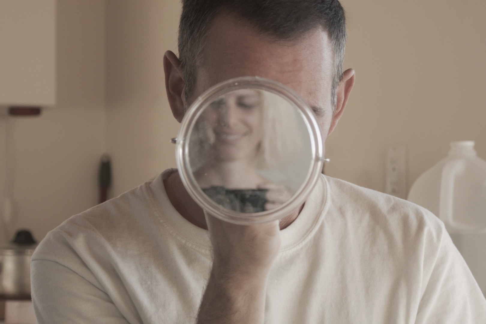
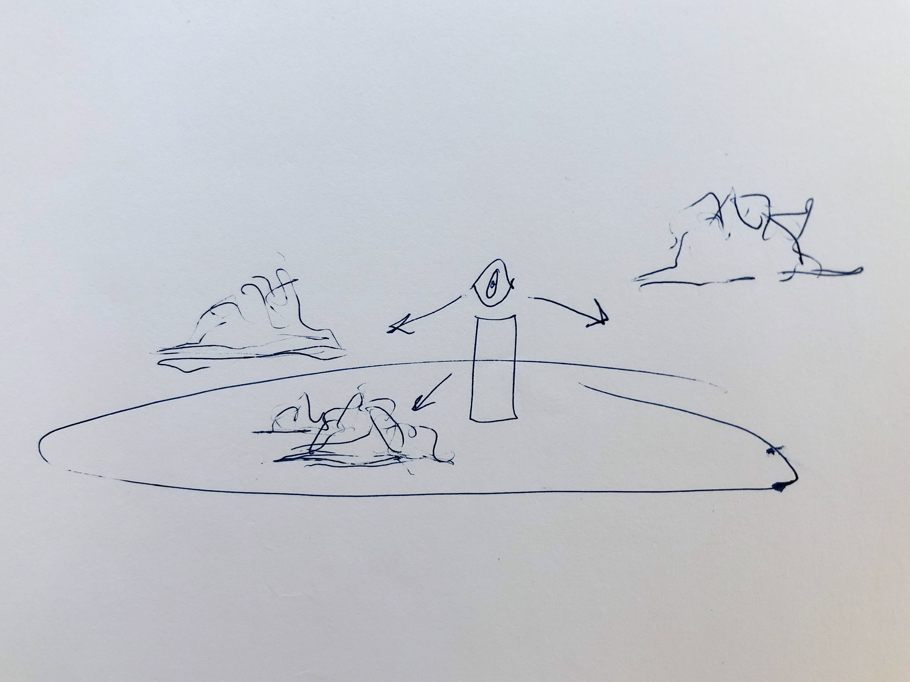

# Seminar Essay

## Abstract and Prototype

<iframe src="https://player.vimeo.com/video/483121354?autoplay=1&loop=1&title=0&byline=0&portrait=0" style="position:absolute;top:0;left:0;width:100%;height:100%;" frameborder="0" allow="autoplay; fullscreen" allowfullscreen></iframe>

Experimenting with coloured plexi as a form of reflection in the sense of looking back and creating a double image.

**Among the Clouds by Mary Ruefle**

That was the summer there were so many clouds we didn’t know what to do with them. They overflowed the sky—they were on our streets, in our homes, in our drawers and in our cabinets. They were in our cars and on our buses, I even saw them in taxis. No one had ever seen so many clouds, to the extent, as often happens with a glut, no one could remember a time without them. Our legislators tried to ship them to another country but the question came back—what would one do with so many clouds? There was no wind, no rain, nothing to break them up or break off the endless building up of them. Ship them to Mars, someone said, but Mars could not sustain them. You needed an atmosphere for that, and how odd was that, since so many clouds clouded our atmosphere and every citizen felt they were in a play, at the theatre, overcome by another’s mood, at the mercy of the infinite nostalgia of subconscious dictates. I was not the first to be surprised and often terrified by their images. They cast long shadows in an unearthly light. Some were blue, some were gray, some black, some white, some were pink, some were lavender, some orange, some a ghastly purple. All cast a trance and a silence upon us. I registered without choice the complaints of a multitude. Our dreams of a solution, even the most obscure, dissolved in the profound and vital roots of an intractable reality. The picture of a limp cloud watching us was undeniable. They were irrational, impossible, baffling and alarming, solitary, in strata, stippled as a fish back, fantastically shaped and plain as the day is long. They hypnotized us and paralyzed us. Yet they remained, in the highest and lowest places, and the meticulous exact realism of them convinced us to capture them, and zoo them, and feed them, to the extent others, far into the researchable future, would be able to see what was the temporary but encroaching weight of their total reality, and perhaps understand our hopelessness of ever understanding them, why they were so crowded among us, given we were crowned with brains to override them, which proved impossible, though there are so few left who remember. Even now, so many years later, when strolling idly, say on a Sunday, under a spotless sky, when I meet a child carrying in her right hand, like a torch, a tuft of spun sugar on a stick, the familiar cry of that summer comes back to me, the one that floated out of the mouths of so many children: o mother, o father, wherefore art thou? I cannot see to find thee among so many clouds. 

